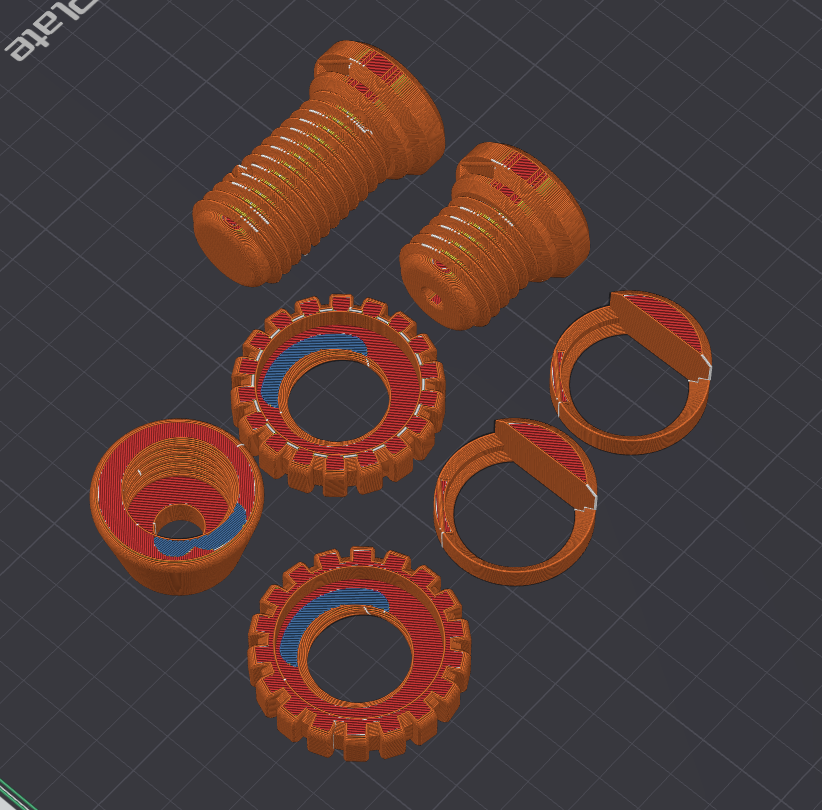
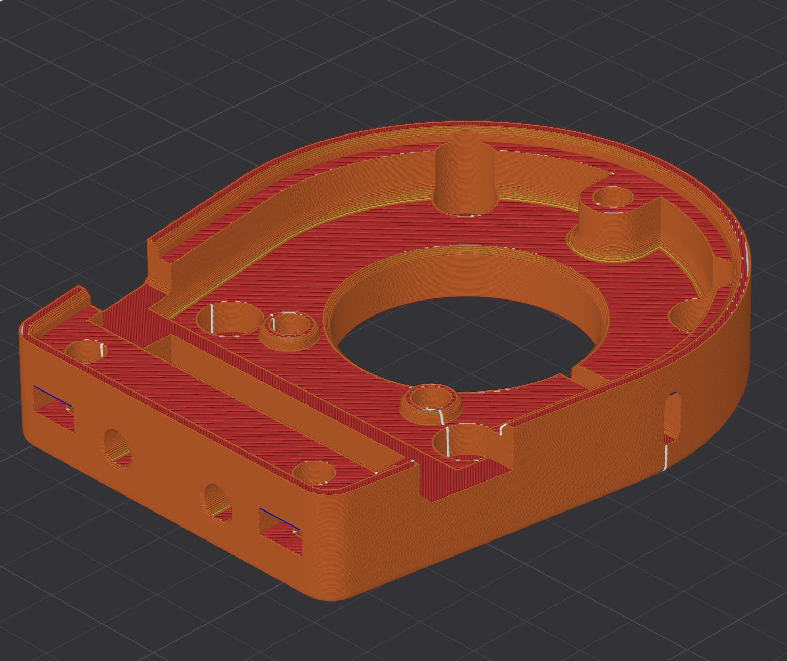
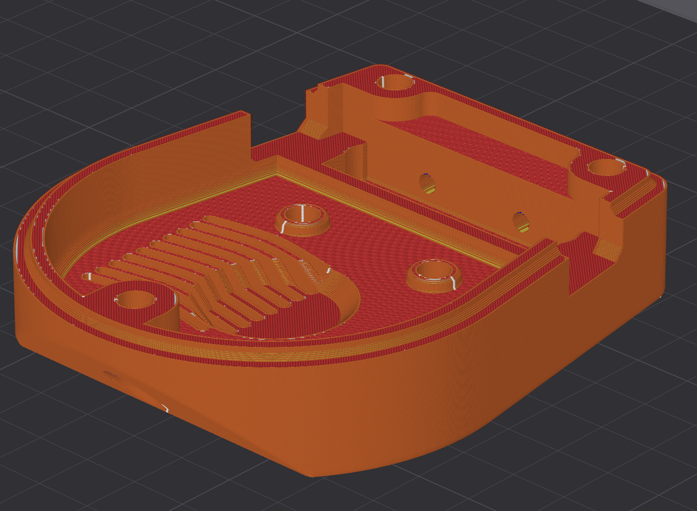
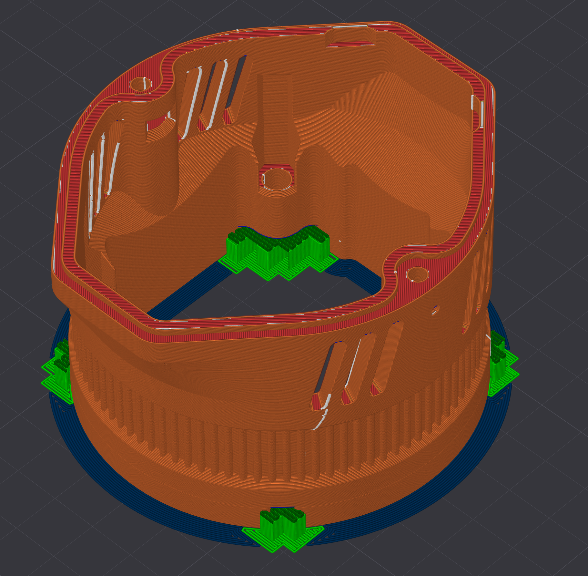
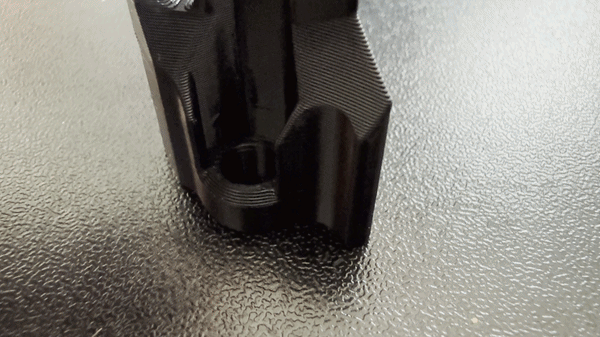
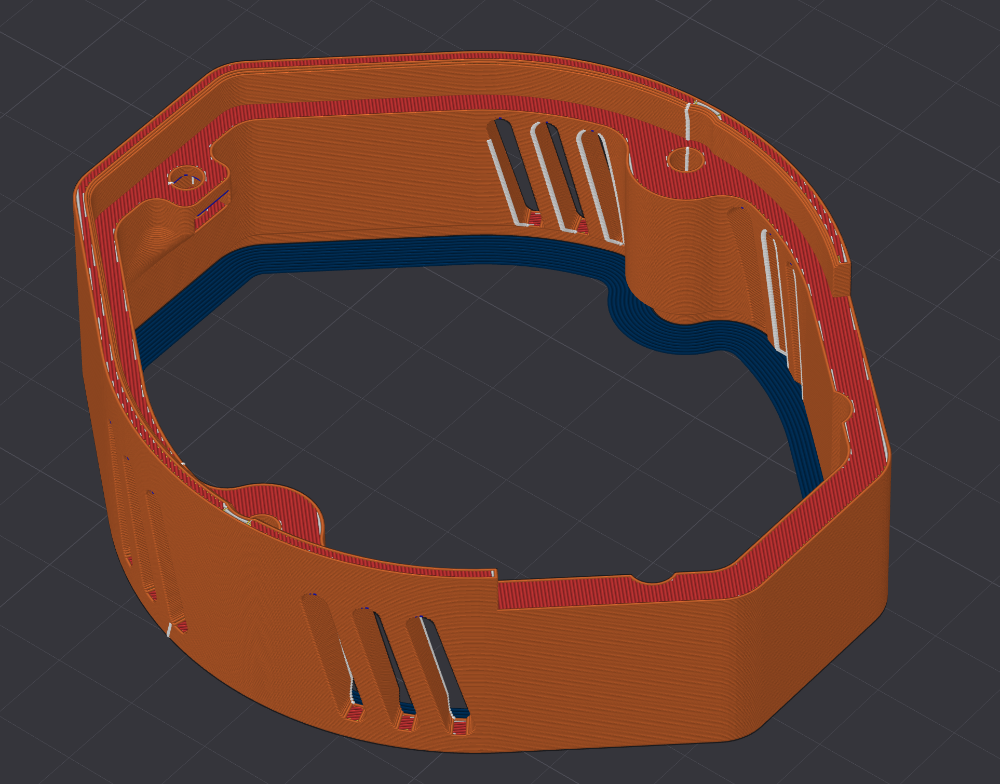
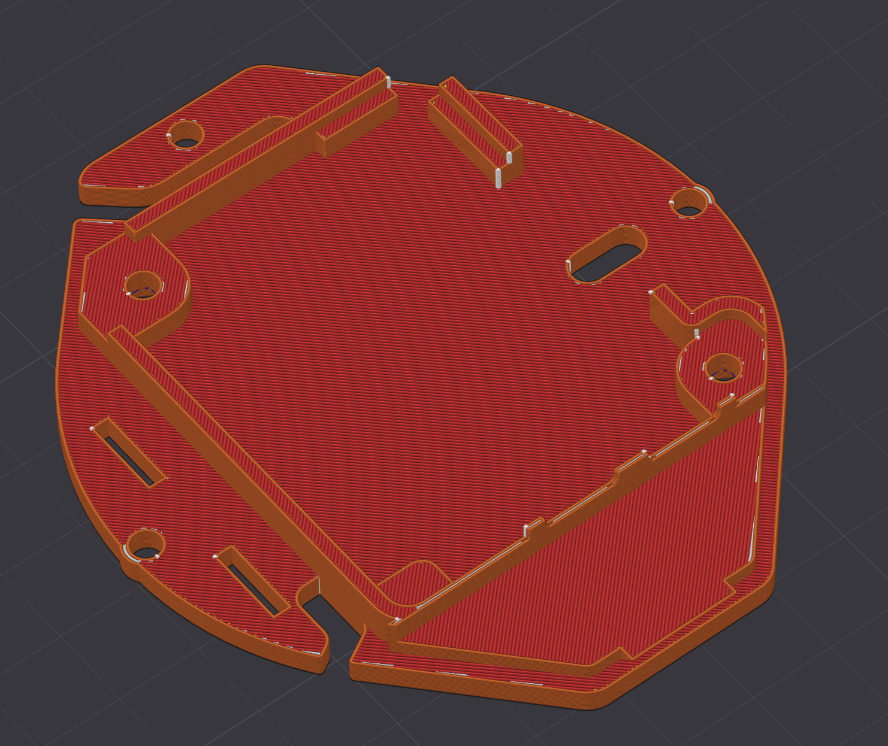
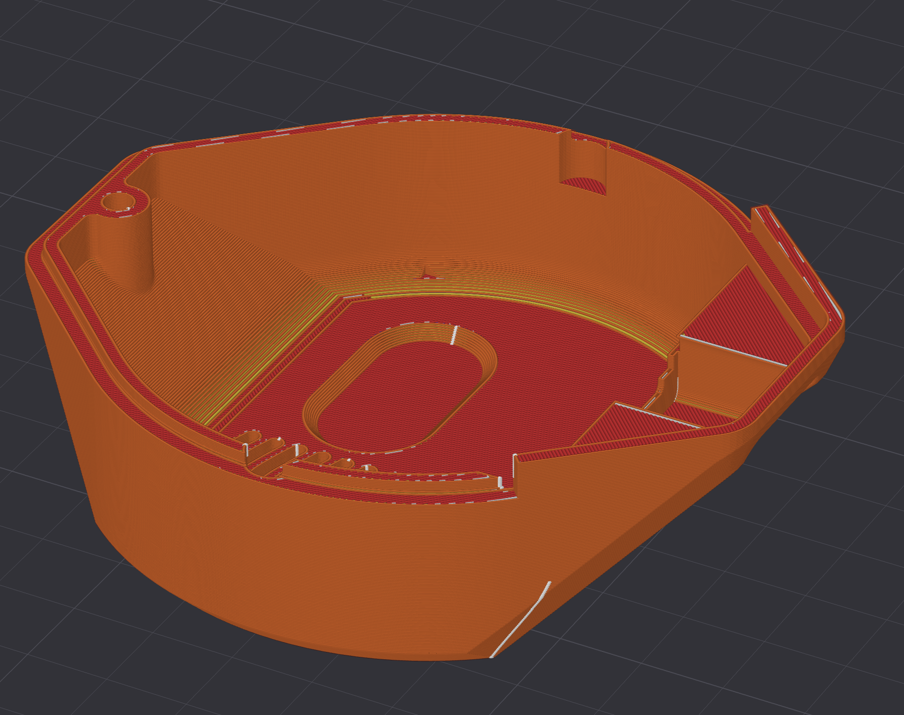
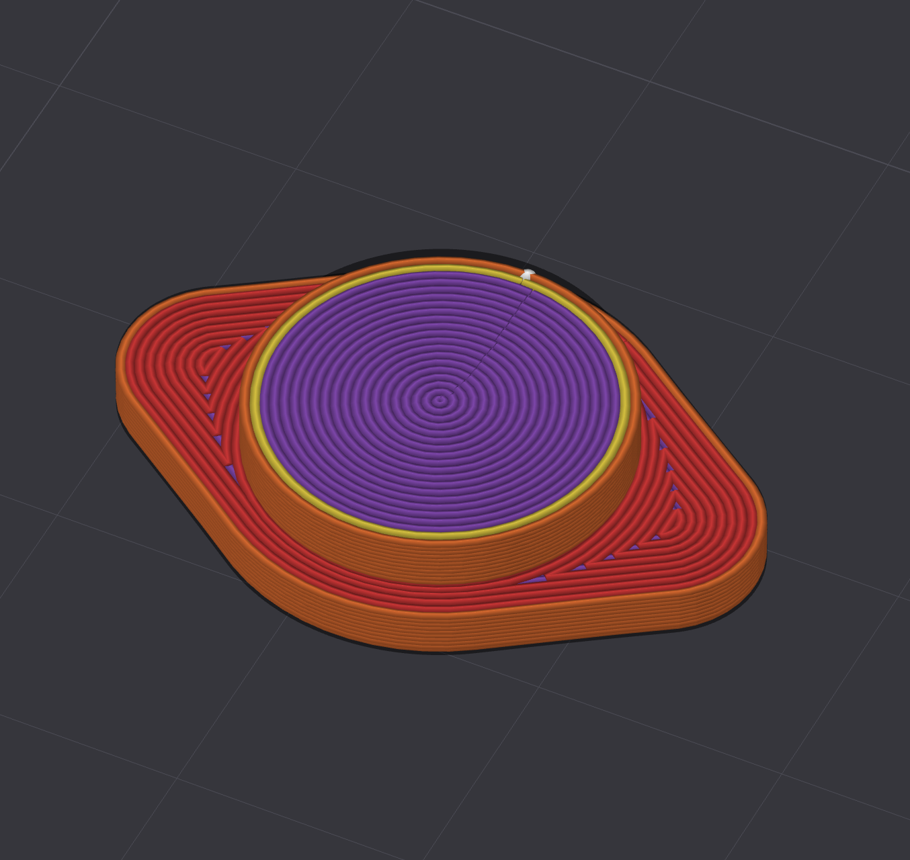

# OSSM ALT Edition — 3D Print Manual

## Introduction

This manual covers all 3D printed parts for the OSSM ALT Edition (excluding Pitclamp) and provides guidance on print settings, part orientation, and support material usage to ensure successful prints.

The OSSM ALT Edition comes in two variants:

- **Heavy (MGN15H)** — uses MGN15H linear rails
- **Light (MGN12H)** — uses MGN12H linear rails

Print settings described in this manual are intercompatible between both variants unless explicitly noted otherwise.

---

## Tested Printers & Materials

The table below lists printers and materials that have been tested. Use this as a reference when choosing your setup or when getting things printed by an external party.

| Printer | Tested Materials | Recommended Printer | Notes | User
|---|---|---|---|---|
| Prusa XL | PLA / PET-G | Yes | No troubles. Tolerances are fine with default Prusa Profiles. PET-G tolerances are a bit tighter which makes it more difficult to place embedded nuts. | BuildingRandomThings
| Prusa Core One (L) | PLA | Yes | No troubles. Tolerances are fine with default Prusa Profiles. | BuildingRandomThings
| Bambulab A1 | PLA Basic, Tough PLA | Yes | No troubles. Tolerances are fine with default profiles. Tough PLA embedded nuts are tighter though. | BuildingRandomThings
| Bambulab X1C Carbon | Matte PLA | Yes | No troubles. Tolerances are fine, but the matte prints are a lot weaker (especially when printed at high speeds) | BuildingRandomThings
| Ultimaker S5 | PLA | No | This is an older printer that works fine for a lot of things, but the tolerances are not up to par with newer printers (partially due to the 2.85mm filament). Therefore it is not recommended. This printer was tested since it is very common at makerspaces | BuildingRandomThings

---

## General Print Settings

These settings apply to all parts unless a specific part section states otherwise. 

| Setting | Recommended Value |
|---|---|
| Layer height | 0.2mm (Important due to bridging designs)|
| Wall count / Perimeters | 6 for mechanical parts, 2 for decorative |
| Top/Bottom layers | 5 top and 3 bottom @0.2mm layer height |
| Infill percentage | 25% strength & 15% decorative|
| Infill pattern | Grid |
| Print speed | High speeds are detrimental for strength. Outer walls are printed at reduced speed for better quality (60mm/s). I don't recommend going over 200mm/s for inner walls and infill (mechanical parts). Speed is much less of a concern for decorative pars.  
| Support | This design is optimized for minimal support. There is only 1 part that needs support. Please do not place support unless specifically mentioned. |
| Recommended Material | PLA with good settings is more than strong enough. Tough PLA is recommended for parts requiring additional durability or impact resistance, but not necessary for 'general usage'. I don't recommend matte/satin filaments due to their reduced strength/brittleness. PET-G also works fine and can handle impacts better, but is less rigid. |
| Total Filament | ±315g |

---

## Parts

---

### 1. Belt Clamp & Toy Mount (combined)

**Description:**
> _Belt tensioners / clamp & M24 accessory mount. These parts are redesigned and tested for extreme abuse. However, printing orientation is very important for strength so please pay attention to the image below and use the recommended settings. Also avoid matte/silk or other weak materials._

**Print Settings:**

| Setting | Value |
|---|---|
| Print Profile | Strength |
| Layer height | 0.2mm |
| Infill | 25% |
| Walls / Perimeters | 6 |
| Weight Estimate | 65g |
| Print Time | ±3h |

**Orientation:**

> _Reference the image below._

**Support Material:**

- Required: No
- Support type: _none_
- Notes: _Please don't use supports._

**Notes:**
> _This should fit all the original OSSM M24 Hardware. The length of the thread is a little bit shorter than standard, because I deem that unnecessary and did not like the look of it. Theoretically the original clamps should work as well for the MGN12 version, but this is untested. I've already designed several accessories that fit well with these parts such as a suction cup mount (check accessory folder)._

---

### 2A. Belt Mechanics Bottom

**Description:**
> _This is mechanically the most important part. Print with strength profiles (i.e. 6 perimeters, 25% infill) and avoid matte/silk/other weak materials. There should not be any play on the dowels and normally you would have to press/hammer it in firm._

**Print Settings:**

| Setting | Value |
|---|---|
| Print Profile | Strength |
| Layer height | 0.2mm |
| Infill | 25% |
| Walls / Perimeters | 6 |
| Weight Estimate | 50g |
| Print Time | ±2h |

**Orientation:**

> _Reference the image below. No support is needed since all the holes have a sequential bridging design. Printing support only leads to worse print quality in this case._

**Support Material:**

- Required: No
- Support type: _None_

**Notes:**
> _The hole on the side allows you to tighten the grub screw even after it is assembled for easy maintenance / extra tightening of this part. The reason for this is that i have noticed that people don't tend to tighten the grub screw enough which may lead to belt slipping._

---

### 2B. Belt Mechanics Top

**Description:**
> _This is mechanically the most important part. Print with strength profiles (i.e. 6 perimeters, 25% infill) and avoid matte/silk/other weak materials. There should not be any play on the dowels and normally you would have to press/hammer it in firm._

**Print Settings:**

| Setting | Value |
|---|---|
| Print Profile | Strength |
| Layer height | 0.2mm |
| Infill | 25% |
| Walls / Perimeters | 6 |
| Weight Estimate | 60g |
| Print Time | ±2.5h |

**Orientation:**

> _Reference the image below. No support is needed since all the holes have a sequential bridging design. Printing support only leads to worse print quality in this case._

**Support Material:**

- Required: No
- Support type: _None_

**Notes:**
> _The hole on the side allows you to tighten the grub screw even after it is assembled for easy maintenance / extra tightening of this part. The reason for this is that i have noticed that people don't tend to tighten the grub screw enough which may lead to belt slipping._

---

### 3. Motor Mount

**Description:**
> _This part secures the motor in place. Strenght is crucial, so print at slow speeds with a strong material and a minimum of 4 perimeters. Some force might be required to get the M5 lock nuts in place. Normal M5 nuts will fit with more ease, but might loosen over time due to vibrations._

**Recommended Print Settings:**

| Setting | Value |
|---|---|
|Print Profiles | Strenght |
| Layer height | 0.2mm|
| Infill | 25% |
| Walls / Perimeters | 6 |
| Weight Estimate | ±80g |
| Brim | Generally not needed, but can prevent warping in case of problems with bed adhesion. Use it if you are uncertain / or generally have problems with adhesion. 
| Time Estimate | ±3h |

**Orientation:**

> _Print as shown in the image below. Supports should only be placed the bottom M5 mounts. The other parts can and should be bridged._

**Support Material:**

- Required: Yes
- Support type: _Normal (Tree support is easier to remove, but normal support has a better surface finish on flat areas)._
- Support placement: _Build plate only_
- Notes: _Avoid placing support in m3 slots (use support blockers). All nut slots are designed with sequential bridging and therefore don't need any support._

**Notes:**
> _Please watch the orientation of this part during assembly. The side that says "RS485" should be placed in line with the white RS485 connector on the gold motor and oriented towards the top side of the machine._
> 
> _The M3 nuts might require a little force to press into their slots securely. I've deliberately chosen not to make the holes any wider, because it made assembly horrible (you don't want nuts to fall out during assembly). I find it easiest to press them in halfway by hand and then push the last bit with a screwdriver._

---

### 4. Motor Spacer

**Description:**
> _This part is placed on top of the motor mount. It has no structural requirements and serves as a spacer only. Print with 'decorative' settings. This part does not need any support material, but an inner brim is recommended for better adhesion since warping will make alignment visually less attractive and may affect the overall fit._

**Recommended Print Settings:**

| Setting | Value |
|---|---|
|Print Profiles | Decorative |
| Layer height | 0.2mm|
| Infill | 15% |
| Walls / Perimeters | 2 |
| Weight Estimate | ±20g |
| Time Estimate | ±1h |

**Orientation:**

> _Print as shown in the image below._

**Support Material:**

- Required: No
- Notes: _Avoid placing supports. This will only make insertion of the nuts more difficult._

**Notes:**
> _Tolerances can be a little bit different for different nuts and printers. The M3 nuts might require a little force to press into their slots securely. I've deliberately chosen not to make the holes any wider, because it made assembly horrible (you don't want nuts to fall out during assembly). I find it easiest to press them in halfway by hand and then push the last bit with a screwdriver._

---

### 5. PCB Mount

**Description:**
> _This part secures the main pcb and optional brake pcb while increasing rigidity of the overall design. Again: do not place supports. The nut slots are designed with sequential bridging in mind._

**Recommended Print Settings:**

| Setting | Value |
|---|---|
|Print Profiles | Decorative |
| Layer height | 0.2mm|
| Infill | 15% |
| Walls / Perimeters | 2 |
| Weight Estimate | ±15g |
| Time Estimate | ±30min |

**Orientation:**

> _Print as shown in the image below. No supports._

**Support Material:**

- Required: No

**Notes:**
> _The M3 nuts in this part have a tighter fit which requires pressing them in. It may help to temporarily screw a bolt in the nut and press it in that way. It is necessary for these nuts to be tight since they will otherwise fall out during assembly. If they somehow are loose, glue them in place._

---

### 6. Motor Top Cover

**Description:**
> _This part is primarily decorative and is meant to cover the pcb's. There are several versions in the repository. With logo's (print with an AMS/Toolchanger), without logos' and with/without the RGB led cover._

**Recommended Print Settings:**

| Setting | Value |
|---|---|
| Print Profiles | Decorative |
| Layer height | 0.2mm |
| Infill | 15% |
| Walls / Perimeters | 2 |
| Weight Estimate | ±25g |
| Time Estimate | ±1.5h |

**Orientation:**

> _Reference the image below for orientation._

**Support Material:**

- Required: No
- Support type: _None_
**Notes:**
> _You can print this part at lower layer heights for increased detail/smoothness, but this may affect the sequential bridging that was designed in place._

---

### 7. Optional Led Cover

**Description:**
> _Optional transparent cover the RGB led. Print with a translucent material such as PET-G._

**Recommended Print Settings:**

| Setting | Value |
|---|---|
| Print Profiles | Decorative |
| Layer height | 0.2mm |
| Infill | 5% |
| Infill Type | Grid |
| Walls / Perimeters | 2 |
| Top Layers | 5 |
| Bottom Layers | 3 |
| Surface Pattern | Concentric |
| Weight Estimate | ±1g |
| Time Estimate | ±10min |

**Orientation:**

> _Reference the image below. Non-textured build plates give the best results._

**Notes:**
> _Preferably use a smooth build plate. There are several guides online for increased transparency, but the LED is really bright so that should not be necessary._
> 
> _this part is a press fit. If it does not stay in place, secure it with some glue_

---

## Troubleshooting

| Problem | Possible Cause | Solution |
|---|---|---|
| Part doesn't fit / too tight | Over-extrusion or elephant foot | Calibrate extrusion multiplier, enable first layer compensation. Motor nuts are supposed to be tight and might require some force.  |
| Warping | Poor bed adhesion or cooling | Use brim, printing adhesive, increase bed temperature, reduce fan speed for first layers |
| Layer delamination | Too low temperature or too fast | Increase nozzle temp, reduce speed, reduce cooling |
