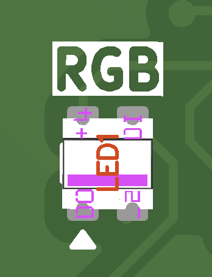
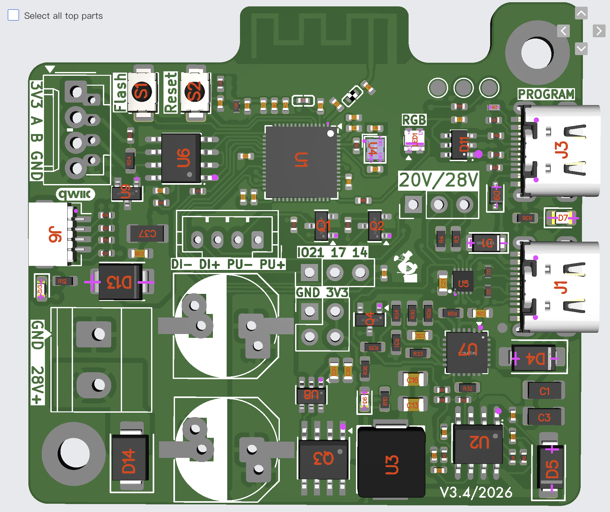
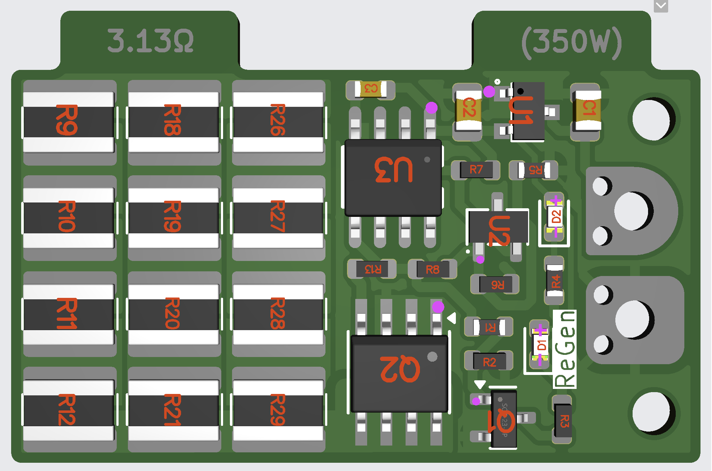
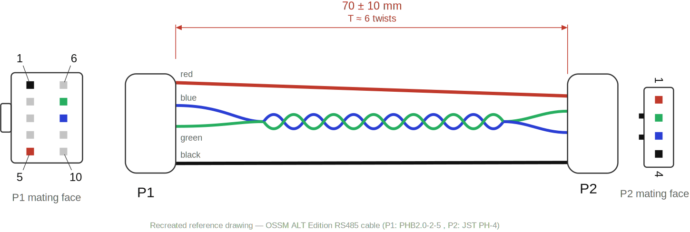
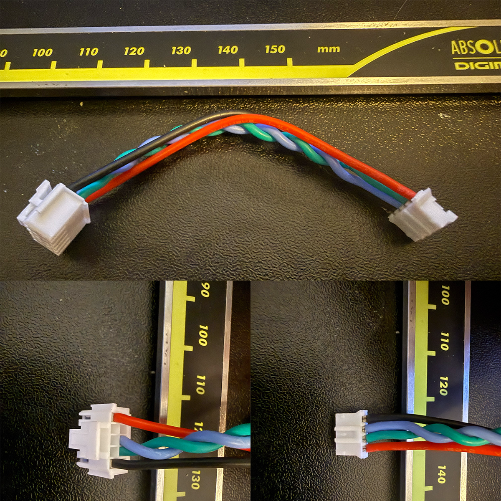

# Production Files

This folder contains everything you need to order the PCBs and cables for the OSSM ALT Edition. There are **two separate boards** plus the **cables**:

| Item | Location | Status |
| ---- | -------- | ------ |
| **Main PCB** (OSSM ALT Servo) | [Main-PCB](Main-PCB/) | ✅ Production ready |
| **Brake Chopper** (optional add-on) | [Brakechopper](Brakechopper/) | ✅ Production ready |
| **Cables** (power & RS485) | [Cable Sourcing](#-cable-sourcing) (below) | ✅ Production ready |

Each version folder contains the Gerber files (zip), BOM and CPL (component placement) files, ready for upload.

---

## 🟢 Main PCB

The main PCB is best ordered from **[JLCPCB](https://jlcpcb.com)**. All components have been selected based on availability from LCSC and compatibility with JLCPCB's **Economic Assembly** service, which saves quite a bit on setup costs compared to Standard assembly.

### PCB Specifications

These are basically the default JLCPCB settings for a 4-layer board, to keep ordering easy. They are written out here in case you use another PCB supplier:

| Setting | Value |
| ------- | ----- |
| Layers | 4 |
| Thickness | 1.6mm |
| Material | Standard FR4, **TG135** |
| Stackup | "No requirement" — currently **JLC04161H-7628** (the default for 4-layer 1.6mm) |
| Outer copper | 1oz |
| Inner copper | 0.5oz |
| Surface finish | HASL — ENIG is nicer/better, but on a 4-layer board it is not supported with Economic Assembly, only Standard |

> ⚠️ **Important**: The material and stackup matter for impedance matching. The WiFi antenna is calculated based on the JLC04161H-7628 stackup (the one JLCPCB selects by default when you choose "no requirement" on a 4-layer 1.6mm board). If you order elsewhere, match this stackup as closely as possible.

### Assembly Settings

- Select **PCB Assembly**, **top side** only.
- Choose the **Economic** assembly type. All parts have been sourced to be compatible with it.

> 💡 **Tip — parts out of stock?** The hard part of ordering via Economic Assembly is that not all parts are always in stock. Have a look at JLCPCB's **Part Sourcing** section on their website: you can pre-order parts beforehand at very affordable prices and build your own personal inventory. Once everything is in your personal stock, you can place the assembly order.

### Parts You Solder Yourself

To save costs, the through-hole headers and the back-emf capacitors are **not** pre-soldered. These are easy through-hole parts you can solder at home:

| Qty | Part | LCSC # | Purpose |
| --- | ---- | ------ | ------- |
| 2 | 1x3 pin header, 2.54mm | [C32713269](https://jlcpcb.com/partdetail/C32713269) | Voltage selection & IO |
| 1 | 2.54mm jumper | [C20417895](https://jlcpcb.com/partdetail/C20417895) | Voltage selection (20V/28V) |
| 1 | JST PH 1x4 connector | [C131334](https://jlcpcb.com/partdetail/C131334) | RS485 cable connection |
| 1 | *(alternative)* 4-position 2.54mm terminal connector | [C918122](https://jlcpcb.com/partdetail/C918122) | Use instead of the JST PH if you don't want to crimp a custom cable |
| 1 | 2-position 5.08mm power terminal | [C8465](https://jlcpcb.com/partdetail/C8465) | 28V power input |
| 2 | 470µF 50V hybrid polymer capacitor | [C53237827](https://jlcpcb.com/partdetail/C53237827) | Catches back-EMF spikes |

### About the Capacitors (Back-EMF)

The two 470µF 50V hybrid polymer capacitors are **very important if you don't use a brake chopper** — they catch the back-EMF spikes from the motor. With the brake chopper installed you could get away with a smaller SMD variant.

You can also choose 35V versions, which are available at 1000µF each (2000µF total). For smaller/regular sized toys this would be safe enough to run without a brake chopper. **However**, under heavy usage with very fast back pressure, the voltage can rise to around **43V** with 1000µF of capacitance — above the 35V rating. With 2000µF it would stay lower, but this is **not recommended and not tested**. When in doubt, stick with the 50V parts.

### Polarity Checks (Important!)

JLCPCB will probably send you an email asking to **confirm the orientation of the WS2812 RGB LED** — for some reason they keep doing that with this specific part. Just confirm the polarity matches the image below and continue:



Also check all other polarities (diodes, polarized capacitors). If you use the **provided CPL file, it should be fine** — but a fresh export from KiCad will probably *not* have the right rotations, and you will need to check them yourself. Use this overview of the fully placed top side as reference:



---

## 🟡 Brake Chopper

The brake chopper is an optional add-on designed as **extra protection for the main PCB**. It catches the voltage spikes from the motor that happen when the motor rapidly decelerates, changes direction, or is pushed back. This has been thoroughly tested: it stops all spikes over **33V**, which then get dumped into the 1218 resistor bank.

The production files can be found in [Brakechopper/v1_1](Brakechopper/v1_1/).

### PCB Specifications

| Setting | Value |
| ------- | ----- |
| Layers | 2 |
| Copper | 1oz |
| Surface finish | ENIG or HASL (both will work) |

### Single or Double Sided Assembly

You can choose to have this board assembled **one sided or double sided** — both will work, but the power dissipation rating of the resistor bank differs:

| Assembly | Resistors | Power dissipation rating |
| -------- | --------- | ------------------------ |
| Double sided | 24 | 24W |
| Single sided | 12 | 12W |

> **Note**: this is *not* a continuous rating — the board is not designed to draw power continuously. It only dissipates the short braking spikes.

It's a clean design that you should be able to source at very low cost: the first single-sided version came out at roughly €1.50 each assembled, and the double-sided version at around €5. Both will probably be pricier at lower quantities.

### Sourcing the Resistors (the hard part)

The tricky part is sourcing the resistors in larger quantities: 10 boards is already 240 resistors, and 100 boards means finding 2400 of them. JLCPCB can ask extreme prices for ordering these reels, so it makes more sense to **pick a resistor value that is in stock / affordable to source** rather than insisting on one exact value.

The reference design uses **4.7Ω** resistors. On the double-sided board the bank is wired as: top+bottom pairs in parallel (4.7Ω / 2 = 2.35Ω), 4 of those in series (9.4Ω), and 3 of those columns in parallel — giving a total resistance of:

```
(4.7Ω / 2) × 4 / 3 ≈ 3.13Ω
```

At the 33V clamping point that dissipates **P = V² / R = 33² / 3.13 ≈ 348W** (about 10.5A) during a braking event.

For a **single-sided** board there are no parallel pairs, so the total is simply `value × 4 / 3`. With only 12 resistors, a value of around **2.4Ω** makes more sense:

```
2.4Ω × 4 / 3 = 3.2Ω  →  33² / 3.2 ≈ 340W
```

> ⚠️ **Rule of thumb**: aim for roughly **3.1–3.2Ω total resistance (~350W dissipation)**. I would not go higher than this — a too high total resistance lowers the spikes the board can catch which means that these spikes then still go to the main board.

### Status LEDs

The board has two LEDs:

- 🟠 **Orange** — the board has power.
- 🔴 **Red** — the voltage has risen above 33V and the brake chopper is actively dumping into the resistor bank.

### Polarity Checks

Just like the main PCB: check the component polarities against the provided images before confirming the order.



---

## 🔌 Cable Sourcing

### Main Power

For the main power supply to the board I use **18 AWG silicone cables**. These silicone cables are nice and flexible and can easily handle the currents.

### RS485 Cable

For the RS485 connection between the board and the motor there are two options:

1. **Terminal block** — use the 4-position terminal connector ([C918122](https://jlcpcb.com/partdetail/C918122), see the main PCB parts table), cut the connector off one side of the cable that came with the motor, and hook it up that way.
2. **Custom RS485 cable** — this is what the boards I sold use. It's more foolproof and easier to assemble/disassemble.

For the custom cable I used **LCSC's cable assembly service**. To give an idea of pricing: 50 pieces cost around **€85 including shipping** — it probably makes more sense at higher quantities. At lower quantities you should be able to crimp them yourself with the parts below.

The cable specs: roughly **70mm long**, **24 AWG silicone wire**, with the data pair twisted (**~6 twists**). Twisting shouldn't be necessary at this short length, but it's basically free when ordering through LCSC.

> **Note**: I can't share the original manufacturer drawing (I don't hold the copyright), so the drawing below is a recreation with the same information.



Wiring table (also shown in the drawing — the used pins are colored in the P1 mating face view):

| Wire | P1 pin | P2 pin |
| ----- | ------ | ------ |
| Green | 7 | 2 |
| Blue | 8 | 3 |
| Red | 5 | 1 |
| Black | 1 | 4 |

The numbered callouts in the drawing match this parts list:

| # | Part | Qty | Description | LCSC # |
| - | ---- | --- | ----------- | ------ |
| 1 | Wire | 4 | UL1007 24 AWG (red / blue / green / black), L = 70mm | — |
| 2 | Housing | 1 | 2.0mm pitch, 2×5 positions, white — Megastar ZX-PHB2.0-2-5PJK | [C19078773](https://www.lcsc.com/product-detail/C19078773.html) |
| 3 | Terminal | 4 | Tin plated, 24–28 AWG — Megastar ZX-PHB2.0-2-DZ | [C19078769](https://www.lcsc.com/product-detail/C19078769.html) |
| 4 | Housing | 1 | 2.0mm pitch, 4 positions, white — JST PHR-4 | [C111514](https://www.lcsc.com/product-detail/C111514.html) |
| 5 | Terminal | 4 | Tin plated, 22–26 AWG — JST SPH-001T-P0.5S | [C495193](https://www.lcsc.com/product-detail/C495193.html) |

To clarify, here are photos of a finished cable and close-ups of both connector ends:



---

## ⚠️ Disclaimer

No warranties are given based on the information in this document. Ordering PCBs and cables is always a risk, and I take no responsibility for the correctness of this information. Previous experience with ordering PCB assembly definitely helps — these are not the easiest boards.

